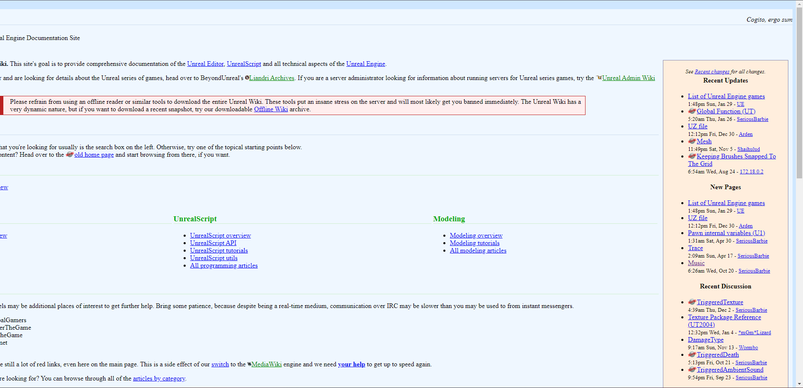
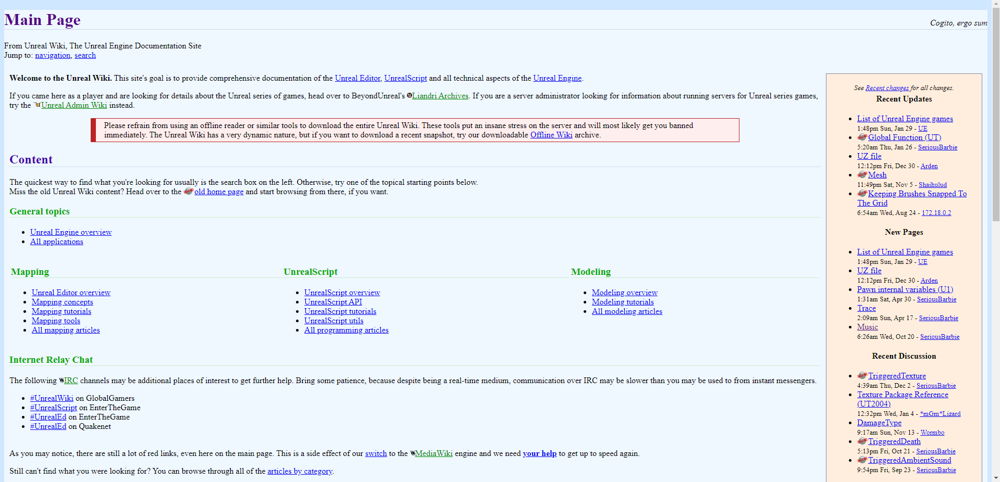

# Normalizer of wiki.beyondunreal.com
This simple Chrome extension which fix wiki.beyondunreal.com
# Without

# With

# Installation
Go to the extension page in your browser (I made it for Chrome :D) like `chrome://extensions/`  and enable developer mode
further load unpacked extension